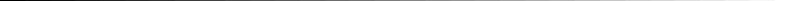

# Testing Gio’s gamma correction

This small gio program crates a window showing two gray ramps.

The top ramp creates the gray by using anti-aliasing.
A 50% covered pixel should be perfectly mid-gray.

The bottom ramp is simply drawing rectangles filled with a
gray different values of gray. 

Both ramps should be identical.

A reference ramp from ["what every coder should know about gamma"](https://blog.johnnovak.net/2016/09/21/what-every-coder-should-know-about-gamma/) is visible below

